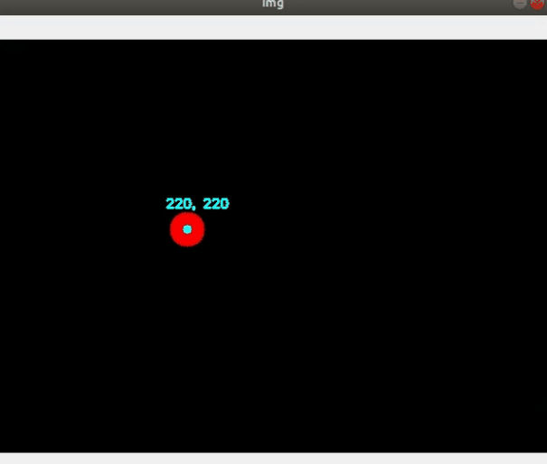
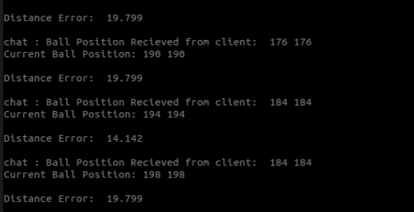

# Readme for running the Project

## Overview
For this project, we generate two files server.py and client.py are created. Server is responsible to generate continous frames of a ball bouncing around the screen using opencv and numpy and send these frames asynchronouly to the Client. Now, Client has to display these frames and parse them to find the coordinates of the ball (I use thresholding and _cv2.moments_ to calculate the centre point) and send them back to the server. Once server recieves these coordinates, it has to calculate the euclidean distance between current coordinates and the recieved coordinates and display on the terminal.



---
## Dependencies
- Ubuntu 18.04 (Operating System)
- Python 3.9.7
- aiohttp==3.8.1
- aioice==0.7.6
- aiortc==1.3.0
- aiosignal==1.2.0
- apeye==1.2.0
- async-timeout==4.0.2
- asyncmock==0.4.2
- asynctest==0.13.0
- attrs==21.4.0
- av==8.1.0
- mock==4.0.3
- multidict==6.0.2
- multiprocess==0.70.12.2
- numpy==1.22.2
- opencv-python==4.5.5.62
- pytest==7.0.1
- pytest-asyncio==0.18.2

---
## How to Run the Code

- Start a terminal instance, go to directory _docker_server_ and run following command:
  ```
  python server.py
  ```
- Start another terminal instance, go to directory _docker_client_ and run the following command:
  ```
  python client.py
  ```
- Copy the dictionary object of type _offer_ from _server.py_ terminal and paste it in the client.py terminal.
- The client generates a dictionary object of type _answer_ as a response to this offer, so copy this to the _server.py_.
- The comuunication is established successfully and the server will start transmitting frames and client will start transmitting coordinates, also client will record the video of the incoming frames using Mediasink.
- To stop the connection, go to any terminal and press any key.
- To run unit test cases in the root directory, run following command:
  ```
  pytest -v test_YOUR_SCRIPT.py
  ```

---
## Docker Build and Run Instructions
- To build the docker image from terminal run (same commands for both server and client, just change the directory):
  ```
  docker build -t <your_docker_id>/<project_root_directory> . 
  ```
- To run docker container:
  ```
  docker run <your_docker_id>/<project_root_directory>
  ```
- To push docker image to remote repository:
  ```
  docker push <your_docker_id>/<project_root_directory>:latest
  ```

---
## Minikube deployment 

- Deployment commands (from deploy directory)
  ```
  kubectl apply -f client-pod.yaml
  ```
  ```
  kubectl apply -f client-node-port.yaml
  ```
- To check status of all running pods
  ```
  kubectl get pods
  ```
- To check the running services
  ```
  kubectl get services
  ```
- To get ip of the virtual machine:
  ```
  minikube ip
  ```
